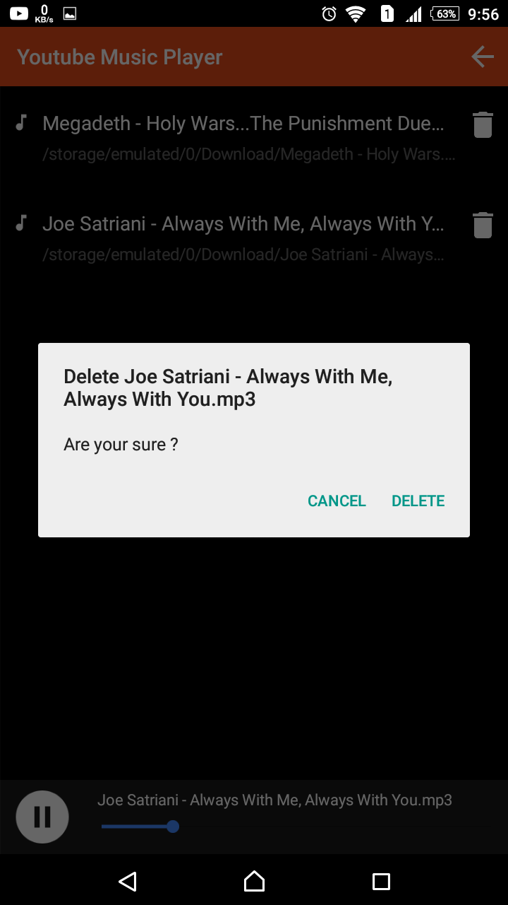

# Youtube Audio

> A Nativescript Application to search youtube video and download the audio.

## Usage

```bash
# Install dependencies
npm install

# Build for production
tns build <platform> --bundle

# Build, watch for changes and debug the application
tns debug <platform> --bundle

# Build, watch for changes and run the application
tns run <platform> --bundle
```

| Search                              | Download                              |
| ----------------------------------- | ------------------------------------- |
|  |  |
| Delete Prompt                       | Music Player                          |
|  |    |
